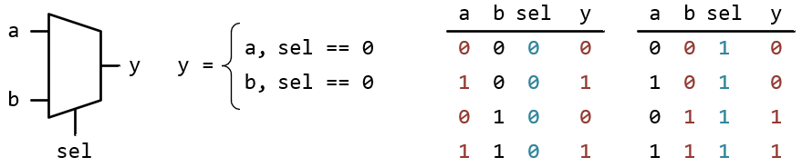
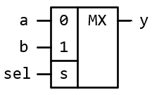
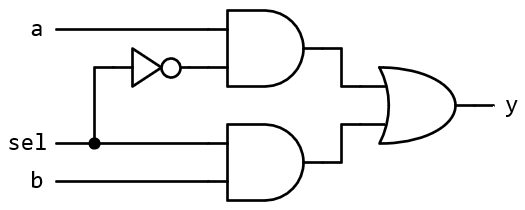
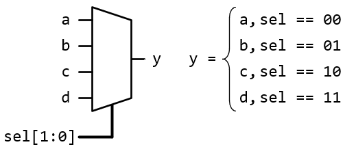
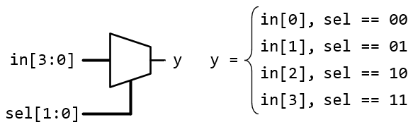
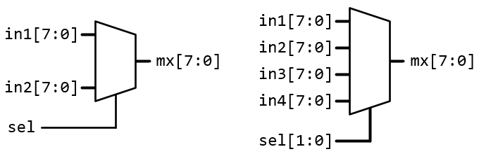
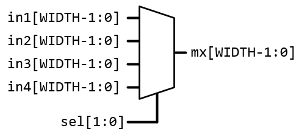
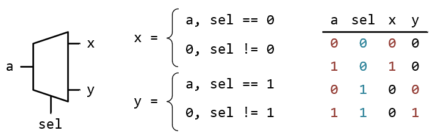
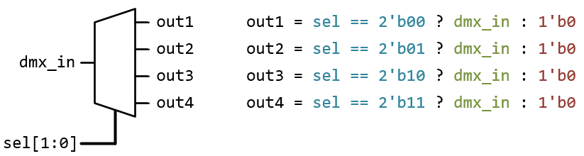

# Синтез типових елементів цифрових систем за допомогою HDL-мови Syslem Verilog

## 1. Елементи комбінаційного типу

### 1.1 Мультиплексори

__Мультиплексори (MUX, MX)__ - це цифровий пристрій, що дозволяє вибирати один із декількох вхідних сигналів і передавати його на єдиний вихід. Мультиплексор використовує кілька керуючих (селекторних) сигналів для визначення, який вхідний сигнал потрібно передати на вихід.

Різновиди мультиплексорів за кількістю інформаційних входів:
* 2-в-1: два вхідні сигнали, один керуючий.
* 4-в-1: чотири вхідні сигнали, два керуючих.
* 8-в-1: вісім вхідних сигналів, три керуючих.
* 16-в-1: шістнадцять вхідних сигналів, чотири керуючих.

Найпростіший мультиплексор позначається наступним чином:



Альтернативне позначення мультиплексора за вітчизняними стандартами:



Мультиплексор можна описати за допомогою еквівалентної логічної схеми:



$$ y = ( a \; AND \; \overline{sel} ) \; OR \; ( b \; AND \; sel ) $$

Опис мультиплексору 2-в-1 за еквівалентною схемою та логічним виразом:

```SystemVerilog
module mux_2to1 (
    input logic a,   // перший вхід
    input logic b,   // другий вхід
    input logic sel, // керуючий сигнал
    output logic y   // вихід
);
    // combinatotial implementation of mux
    assign y = a & ~sel | b & sel;

endmodule
```

Але при описі типових пристроїв комбінаційного типу в подальшому будуть використовуватися процедурні блоки `always_comb` та відповідні кодові конструкції (`if .. else`, `case`, `for` та ін.). Такий спосіб опису більше відповідає визначенню "поведінковий опис" та легше сприймається при аналізі коду.

Опис мультиплексору 2-в-1 з використанням процедурного блоку `always_comb` та конструкції умовного виконання коду `if .. else`:

```SystemVerilog
module mux_2to1 (
    input logic a,   // перший вхід
    input logic b,   // другий вхід
    input logic sel, // керуючий сигнал
    output logic y   // вихід
);
    always_comb 
    begin
        if (sel) 
            y = b;
        else 
            y = a;
    end
endmodule
```
Надалі код буде подаватися в окремих файлах у вигляді посилання: [mux_2to1.sv](src_code/mux_2to1.sv)

Мультиплексор 4-в-1: 



[mux_4to1.sv](src_code/mux_4to1.sv)

Мультиплексор 4-в-1 -- векторний формат інформаційних входів:



[mux_4to1_vect_input.sv](src_code/mux_4to1_vect_input.sv)

[mux_8to1_vect_input.sv](src_code/mux_8to1_vect_input.sv)

Часто доводиться виконувати комутацію векторних входів. Для цього застосовуються мультиплексори з векторними інформаційними входами.



[mux_2to1_8bit.sv](src_code/mux_2to1_8bit.sv)

[mux_4to1_8bit.sv](src_code/mux_4to1_8bit.sv)

Можна створити універсальний мультиплексор певного типу, в якому розрядність шин, що комутуються, можна налаштовувати за допомогою спеціального параметру на місці використання екземпляру компоненту. 



[mux_4to1_Nbit_param.sv](src_code/mux_4to1_Nbit_param.sv)

### 1.2 Демультиплексори

__Демультиплексор (DEMUX, DMX)__ — це цифровий пристрій, який виконує функцію зворотну до мультиплексора. Він приймає один вхідний сигнал і передає його на один із кількох виходів на основі керуючих сигналів. Демультиплексор використовується для розподілу одного сигналу на кілька каналів.

Основні особливості демультиплексорів:
1. Один вхід: демультиплексор приймає один вхідний сигнал.
2. Кілька виходів: кількість виходів зазвичай визначається як 
$2^n$ , де $n$ — це кількість керуючих сигналів.
3. Керуючі сигнали: використовуються для вибору одного з виходів, на який передаватиметься вхідний сигнал.

Різновиди демультиплексорів:
1. 1-в-2 : один вхід, два виходи, один керуючий сигнал.
2. 1-в-4 : один вхід, чотири виходи, два керуючі сигнали.
3. 1-в-8 : один вхід, вісім виходів, три керуючі сигнали.
4. 1-в-16 : один вхід, шістнадцять виходів, чотири керуючі сигнали.

Загальний принцип роботи демультиплексора 1-в-2 та його графічне позначення:



[dmx_1to2.sv](src_code/dmx_1to2.sv)

Демультиплексор 1-в-4:



Демультиплексор 1-в-8: [dmx_1to8.sv](src_code/dmx_1to8.sv)

Демультиплексори також можуть комутувати шинні (багаторозрядні) входи. Опис таких демультиплексорів дужесхожий на опис DMX для однорозрядних ліній. Також можна створювати описи універсальних демультиплексорів, у яких розмір шин, що комутуються, задається параметром. 

Демультиплексор 1-в-4 для сигналів-шин на 4 біти: [dmx_1to4_4bit.sv](src_code/dmx_1to4_4bit.sv)

Демультиплексор 1-в-4 для сигналів-шин на N біт: [dmx_1to4_Nbit_param.sv](src_code/dmx_1to4_Nbit_param.sv)

### 1.3 Дешифратори

__Дешифратор (DC)__ — це цифровий пристрій, який перетворює двійковий позиційний код із $n$-бітів на унарний двійковий код (one-hot), який виводиться на $2^n$ окремих виходів. Це означає, що на основі вхідного двійкового коду лише один із виходів буде активний (логічна "1"), а всі інші виходи — неактивні (логічна "0"). Дешифратори часто використовуються для вибору одного з кількох пристроїв або комутування сигналів на основі вхідного коду.

Різновиди дешифраторів:
1. Повний дешифратор 2-в-4 : два вхідних сигнали, чотири виходи.
2. Повний дешифратор 3-в-8 : три вхідні сигнали, вісім виходів.
3. Повний дешифратор 4-в-16 : чотири вхідні сигнали, шістнадцять виходів.
4. Неповний дешифратор 4-в-10 : чотири вхідні сигнали, десять виходів, реалізовано не всі можливі кодові комбінації (10 з 16). Решта комбінацій зазвичай ігноруються.


### 1.4 Шифратори

### 1.5 Арифметичні схеми

### 1.6 Спеціальні схеми


## 2. Елементи пам'яті